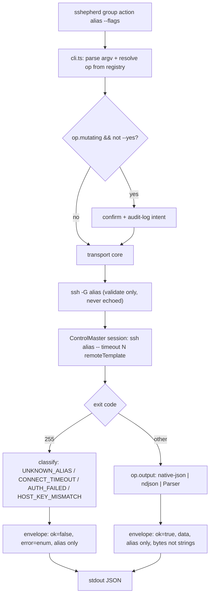
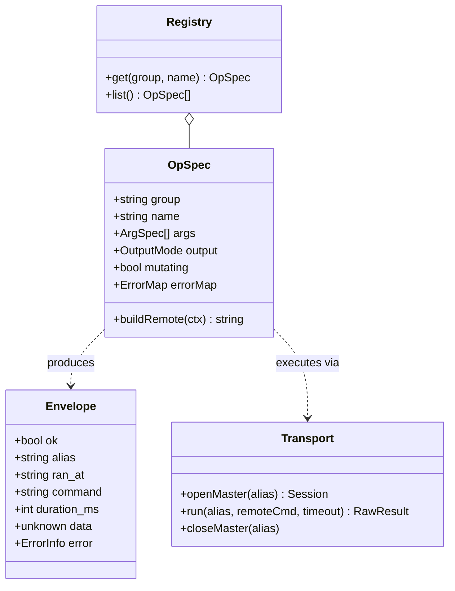

# sshepherd v1 — Orchestration Plan

## TLDR — North Star

> Build `sshepherd`: a compiled Bun/TypeScript CLI + root `SKILL.md` that runs 9 groups of
> curated, structured-JSON server operations over SSH where the agent passes only an alias
> name and credentials never enter the process (we shell out to system `ssh`, never `ssh2`).
> The governing rule: **zero-knowledge is a hard invariant, not a feature** — every op goes
> through the one transport core that discards ssh transport stderr and echoes only the
> alias, so no phase may ever put a HostName/IP/User/port/key into output. Ship it packaged
> exactly like `anywrite` (public repo, root SKILL.md, release binaries, trust signals).

## Open Questions

**Concerns** — none blocking. (DB `<pg-target>` declaration file, audit-log path, and
per-project alias allowlist are recorded as non-blocking design decisions in research.md
§Open questions; Phase 2 fixes their concrete shapes and the user can redirect at review.)

**Confusions** — none. Name and scope are resolved (user sign-off 2026-07-12).

**Assumptions:**
- v1 targets **Linux** remote servers only (native-JSON flags assume systemd/iproute2/
  util-linux). macOS/BSD remotes are out of scope for v1.
- v1 DB support is **Postgres only**; MySQL deferred.
- Bun's built-in `Bun.TOML` can parse deploy recipes, so the only pure-JS runtime dep is
  `node-sql-parser`. If `Bun.TOML` proves insufficient, add one TOML parser — still ≤2 deps.

## Executive summary

sshepherd solves two linked pains: SSH creds the agent must never see, and remote command
output too messy to reason over. It is a single compiled binary (no runtime install, like
anywrite) wired as a Claude Code skill. The agent invokes `sshepherd <group> <action>
<alias> [flags]`; the CLI resolves the alias through `~/.ssh/config` + ssh-agent entirely
inside OpenSSH, runs a curated remote command from a central ops registry, and returns one
JSON envelope with bytes-not-strings and computed verdict fields. There is no raw-exec
escape hatch — novel needs are authored as named, typed deploy-recipe steps; plain `ssh`
stays the human break-glass. It ships open-source packaged for `npx skills add` discovery
with the full post-ToxicSkills trust-signal set.

## 5W+1H

- **What:** Bun/TS CLI + SKILL.md, 9 command groups (hosts, check, logs, services, deploy,
  config, db, files, security), zero-knowledge SSH, structured JSON, open-source repo.
- **Why:** agent-safe remote ops without exposing credentials (user value); one transport
  core + one envelope so every op is consistent and auditable (technical value).
- **Who:** the user + any Claude Code / terminal user managing Linux VPS/docker-compose
  stacks; affected systems = remote servers reached only via existing SSH aliases.
- **When:** done = all 9 groups implemented, `just check`/`just test` green, smoke suite
  green against local sshd container, repo publishable. See research.md §Definition of done.
- **Where:** new repo `~/Documents/PROJECT_MISPAQUL_ATTORIQ/sshepherd`; runtime touches only
  `~/.ssh/config`, ssh-agent, `~/.config/sshepherd/`, `~/.local/state/sshepherd/`.
- **How:** registry-dispatch — a central ops registry is the extension seam; a transport
  core executes any registry entry; the CLI parses argv and dispatches. Mirrors anywrite's
  registry.ts/client.ts/cli.ts split.

## Diagrams

## File inventory

### Files to create

Repo scaffold + config:
- `package.json` — private, bin `sshepherd` → `./dist/sshepherd`, scripts mirror anywrite
- `tsconfig.json`, `biome.jsonc`, `justfile`, `.gitignore` (ignore `dist/`, `node_modules/`)
- `LICENSE` (MIT), `README.md`, `CONTRIBUTING.md`, `SECURITY.md`
- `.github/workflows/ci.yml` (typecheck + lint + test), `.github/workflows/release.yml`
  (4-platform build + checksums + `actions/attest-build-provenance`)
- `.claude-plugin/marketplace.json`, `.claude-plugin/plugin.json`
- `docs/progress.md`, `docs/changelog.md`

Core (`src/`):
- `src/types.ts` — `Envelope`, `OpSpec`, `ArgSpec`, `OutputMode`, `ErrorInfo`, error enum
- `src/quote.ts` — single remote-shell quoting function (single-quote wrap, `'\''` escape)
- `src/output.ts` — envelope builder, byte helpers, NDJSON splitter, `--pretty` renderer
- `src/transport.ts` — ssh shell-out, ControlMaster lifecycle, `-G` validation, error
  classification, transport-stderr discard
- `src/parsers/` — TS parsers for non-JSON commands (`df.ts`, `free.ts`, `uptime.ts`,
  `ps.ts`, `du.ts`, `ls.ts`), shapes matched to jc reference
- `src/registry.ts` — the 9-group op registry (single source of truth)
- `src/recipes.ts` — TOML deploy-recipe loader + typed-step validator + dry-run planner
- `src/targets.ts` — DB `<pg-target>` resolver (`~/.config/sshepherd/targets.toml`)
- `src/db.ts` — read-only SQL enforcement (role note + txn wrapper + node-sql-parser check)
- `src/audit.ts` — append-only audit log for mutating ops
- `src/cli.ts` — argv parse, allowlist check, confirm/`--yes` gate, dispatch
- `SKILL.md` — root skill file (command matrix + gotchas), `references/*.md` deep docs

Tests:
- `src/__tests__/*.test.ts` — unit (mocked `Bun.spawn`), quoting, parsers, classification,
  SQL-enforcement, recipe validation, envelope hygiene (no host/IP ever present)
- `scripts/smoke.sh` — E2E against a local disposable sshd container
- `scripts/sshd-fixture/Dockerfile` — sshd + docker-cli + coreutils fixture host

### Files to modify

None — greenfield repo. (No gitnexus impact analysis applicable: no existing symbols.)

### Files to NOT touch

- `~/.ssh/config`, `~/.ssh/*` — read via OpenSSH only, never written or parsed for values
- The `anywrite` repo — reference/template only, never edited
- Any real remote server — all automated tests hit the local sshd container only

## Phase breakdown

### Phase 1: Repo scaffold + tooling

**Goal:** `just check` runs clean on an empty-but-configured project that compiles.

**Files:**
- Create: package.json, tsconfig.json, biome.jsonc, justfile, .gitignore, LICENSE,
  placeholder src/cli.ts (prints version), docs/progress.md, docs/changelog.md

**Dependencies:**
- Requires: none (first phase)
- Provides: build/lint/typecheck/test harness every later phase relies on

**Separation of concerns:**
- Handles: toolchain, bun compile target, biome config, just recipes (mirror anywrite)
- Does NOT handle: any ops, transport, or SKILL.md content

**Success criteria:**
- [ ] `just build` produces `dist/sshepherd` that prints a version string
- [ ] `just check` (tsc --noEmit + biome) exits 0
- [ ] `.gitignore` excludes `dist/` and `node_modules/`

**Context:**
- Pattern to follow: `~/Documents/PROJECT_MISPAQUL_ATTORIQ/anywrite/{package.json,justfile,
  biome.jsonc,tsconfig.json}` verbatim shape, renamed to sshepherd.

**Concerns:**
- Keep runtime deps ≤2 (node-sql-parser, maybe a TOML parser) → confirm `Bun.TOML` exists.

---

### Phase 2: Types + transport core + output (the zero-knowledge invariant)

**Goal:** a `transport.run(alias, remoteCmd, timeout)` that connects via ControlMaster,
classifies errors, discards transport stderr, and a `buildEnvelope()` that structurally
cannot include a host/IP/user/port.

**Files:**
- Create: src/types.ts, src/quote.ts, src/transport.ts, src/output.ts, src/audit.ts,
  their unit tests

**Dependencies:**
- Requires: Phase 1 harness
- Provides: the single execution path every op in Phases 3–5 goes through

**Separation of concerns:**
- Handles: ssh shell-out, master socket lifecycle (open/reuse/`-O exit`, opaque short
  socket path), `-G` alias validation (presence only), error enum, envelope shape, quoting
- Does NOT handle: any specific op's remote command or output parsing

**Success criteria:**
- [ ] Unit test: a simulated ssh transport-stderr line containing an IP never appears in
      the envelope (hygiene invariant test)
- [ ] Unit test: exit 255 + "Permission denied" → `AUTH_FAILED`; non-255 → `COMMAND_FAILED`
      with the remote code carried
- [ ] Unit test: quoting escapes `'` as `'\''` and blocks command injection via args
- [ ] `--yes` gate + audit-log entry produced for a mutating op (mocked)

**Context:**
- See research.md §"SSH transport", §"output hygiene", §"error classification",
  §"response envelope". BatchMode/LogLevel/ControlPath/timeout flags are specified there.

**Concerns:**
- ControlPath length <104 chars → derive a short `$XDG_RUNTIME_DIR`/tmp dir + opaque name.
- Never `-t`, never `StrictHostKeyChecking=no`.

---

### Phase 3: Ops registry + read-only groups (hosts, check, logs, services-read, files-read)

**Goal:** the registry exists and every read-only op returns a correct structured envelope
against the sshd fixture (or a mocked transport for CI).

**Files:**
- Create: src/registry.ts, src/parsers/*.ts, tests. (services read-only actions: ps, stats,
  inspect, compose-ps, healthcheck, systemctl status; files read-only: ls, cat, tail,
  download, disk-usage.)

**Dependencies:**
- Requires: Phase 2 transport/output
- Provides: the registry seam + all parsers; proves the native-JSON/NDJSON/parser modes

**Separation of concerns:**
- Handles: registry entries + parsers for read-only ops across hosts/check/logs/
  services/files; NDJSON splitting; bytes + verdict fields (dead_end_risk); log line objects
- Does NOT handle: any mutating op, deploy, db, security-harden

**Success criteria:**
- [ ] `hosts list` returns alias names only (no HostName/User/Port) — hygiene test
- [ ] `check overview` returns all-bytes fields + `dead_end_risk` boolean
- [ ] `services ps` merges inspect data (health/restarts/oom_killed/limits) into each entry
- [ ] `logs docker` returns `{ts, stream, text}` line objects + `next_since`
- [ ] parser unit tests for df/free/uptime/ps/du/ls match expected shapes

**Context:**
- See research.md §"output shaping per remote command", §"ops registry architecture",
  §"command inventory". Native-JSON flag table is authoritative.

**Concerns:**
- Docker `--format json` is NDJSON, `docker inspect` is an array — tag output mode per op.
- `pg_stat_statements`-style "feature absent" degradation applies later (db); here ensure
  a missing command (e.g. no docker) yields a clean `COMMAND_FAILED`, not a crash.

---

### Phase 4: db group (read-only enforcement) + targets

**Goal:** `db` group runs SELECT-only queries against a Postgres reachable via
`docker exec` on the fixture, with layered read-only enforcement.

**Files:**
- Create: src/targets.ts, src/db.ts, db registry entries, tests

**Dependencies:**
- Requires: Phase 2 transport, Phase 3 registry
- Provides: DB introspection ops (list, tables, activity, connections, slow, size)

**Separation of concerns:**
- Handles: `<pg-target>` resolution, `docker compose exec -T db psql` invocation, txn-
  readonly wrapper, node-sql-parser statement-type rejection, pg_stat_activity rollups
- Does NOT handle: any write path (deferred to a future version behind --confirm), MySQL

**Success criteria:**
- [ ] `db query` rejects a non-SELECT statement at the parser layer with a clear error
- [ ] A writable-CTE attempt fails (documents the txn-readonly wrapper as the real gate;
      role-based enforcement noted in target config docs)
- [ ] `db activity` returns numeric `query_seconds`, `blocked_by`, and top-level rollups
      (`backends_total` vs `max_connections`)
- [ ] `db slow` degrades gracefully when `pg_stat_statements` is absent (no error thrown)

**Context:**
- See research.md §"DB access". Layer order: role (doc) → txn wrapper (enforced) →
  parser (UX). `<pg-target>` mirrors the SSH-alias no-credentials model.

**Concerns:**
- Password never transits sshepherd — docker-exec relies on container peer/trust or remote
  `.pgpass`; document this in targets.toml.

---

### Phase 5: mutating groups (services-restart, config, deploy recipes, security-harden)

**Goal:** the mutating surface works with dry-run + confirm + audit, and deploy recipes
load/validate/plan from TOML including the LMS rebuild-then-migrate ordering.

**Files:**
- Create: src/recipes.ts, mutating registry entries (services restart/systemctl-verbs,
  config put/reload/validate, deploy run/status/rollback/logs/migrate, security harden),
  tests + fixture recipe

**Dependencies:**
- Requires: Phases 2–3 (transport, registry, files upload for config put)
- Provides: the full mutating command set — completes the 9 groups

**Separation of concerns:**
- Handles: typed recipe steps (shell|compose|healthcheck|http-probe|wait|migrate),
  `--dry-run` JSON plan, backup-before-write (config put), `--keep-session` harden guard,
  declared-only rollback
- Does NOT handle: multi-host fan-out, package installs, interactive tools (all out of scope)

**Success criteria:**
- [ ] `deploy run <recipe> --dry-run` prints the resolved ordered plan as JSON, executes
      nothing, and marks which steps mutate
- [ ] A recipe with `migrate depends_on up` orders correctly (LMS gotcha expressible)
- [ ] `config put` writes a `.bak-<date>` before overwriting (verified on fixture)
- [ ] `deploy rollback` with no `[rollback]` block refuses with a clear message, never guesses
- [ ] every mutating op requires `--yes` (or interactive confirm) and writes an audit line

**Context:**
- See research.md §"deploy recipes", §"command inventory" (mutating ops marked †),
  and `~/.claude/skills/devops-engineer/references/server-pattern.md` §D for the harden
  no-self-lockout rule.

**Concerns:**
- `shell`-kind steps are the only raw pressure valve — keep them inside named recipes only,
  never expose an ad-hoc `exec`.

---

### Phase 6: SKILL.md + references + CLI polish

**Goal:** a root SKILL.md (anywrite shape) that documents the full command matrix + gotchas,
plus `--help` per group and `references/*.md` deep docs.

**Files:**
- Create: SKILL.md, references/{transport.md,recipes.md,db.md,output-shapes.md}; finalize
  src/cli.ts help output

**Dependencies:**
- Requires: Phases 3–5 (all ops exist to document accurately)
- Provides: the agent-facing contract + human docs

**Separation of concerns:**
- Handles: SKILL.md description (pushy triggering), command matrix, zero-knowledge gotchas,
  per-group `--help`
- Does NOT handle: OSS packaging files (Phase 7)

**Success criteria:**
- [ ] SKILL.md frontmatter has name `sshepherd` + a triggering description covering "ssh",
      "server", "deploy", "remote db", "zero-knowledge creds"
- [ ] `sshepherd <group> --help` lists actions + flags for every group
- [ ] Every documented command matches an actual registry entry (no doc drift — test)

**Context:**
- Pattern to follow: `anywrite/SKILL.md` structure (command shape, quick reference, gotchas,
  errors). Keep it short + human-reviewable (a trust signal).

**Concerns:**
- Doc/registry drift — add a test asserting every SKILL.md command exists in the registry.

---

### Phase 7: OSS packaging + trust signals + release pipeline

**Goal:** the repo is publishable and `npx skills add`-compatible with the full trust set.

**Files:**
- Create: README.md, CONTRIBUTING.md, SECURITY.md, .github/workflows/{ci,release}.yml,
  .claude-plugin/{marketplace,plugin}.json; finalize docs/{progress,changelog}.md

**Dependencies:**
- Requires: Phase 6 (SKILL.md exists at root for the skills walk)
- Provides: publishable open-source project

**Separation of concerns:**
- Handles: README (keyword-rich, install channels, "What sshepherd NEVER does",
  no-telemetry), SECURITY.md, CI + release workflow (4-platform + checksums + provenance),
  plugin marketplace manifests, GitHub topics list in README
- Does NOT handle: pushing to GitHub / creating the remote (user-driven; needs their auth)

**Success criteria:**
- [ ] README has install blocks for `npx skills add`, `/plugin marketplace add`, release
      binary download, and `just build`
- [ ] README "What sshepherd NEVER does" section present (no ~/.ssh key reads, zero outbound
      calls except user SSH, no telemetry, no arbitrary exec)
- [ ] release.yml builds darwin-arm64/darwin-x64/linux-x64/linux-arm64 + SHA-256 +
      `actions/attest-build-provenance`
- [ ] `.claude-plugin/marketplace.json` + `plugin.json` valid
- [ ] SKILL.md is at repo root (skills two-level walk compatibility)

**Context:**
- See research.md §"OSS packaging". Verify against `anywrite`'s README/CONTRIBUTING/workflow
  files as the proven template.

**Concerns:**
- Do NOT commit `dist/` — binaries ship via Releases only.
- Pushing the repo + awesome-list PRs are user-driven (auth + social-proof gate) — leave as
  documented follow-ups, don't attempt them autonomously.

## Cross-phase guidelines

- **Zero-knowledge is the invariant.** No phase may put a HostName/IP/User/port/key into
  any output, log, or error. Every op executes through `src/transport.ts` — never spawn ssh
  directly from an op or the CLI. Each phase touching output adds/keeps a hygiene test.
- **Registry is the only seam.** Adding an op = one `src/registry.ts` row. No if/elif
  dispatch chains, no per-op bespoke execution path (registry-dispatch pattern).
- **One envelope everywhere.** Success and error exit through `buildEnvelope()`; sizes in
  bytes; alias-only identity.
- **Mutating ⇒ dry-run/confirm/audit.** Every op with `mutating: true` requires `--yes` (or
  interactive confirm) and writes one audit line. Read-only ops never prompt.
- **No raw exec.** The only raw-shell path is a named, typed `shell` recipe step. Plain
  `ssh <alias>` is the documented human break-glass; the tool never fakes a REPL over JSON.
- Standards: `~/.claude/rules/coding-standard.md` (KISS, explicit types, one logger, no
  emojis), `~/.claude/rules/persona.md`. Logging: pick one module at init.
- Progress + changelog per `~/.claude/rules/progress-changelog.md` — prepend an entry when
  real work lands.

## Progress log

(Append-only. Executor subagents add one entry after completing each phase.)

### Phase 1: Repo scaffold + tooling — 2026-07-12

**Status:** Complete
**Files created:** package.json, tsconfig.json, biome.jsonc, justfile, .gitignore, LICENSE, src/cli.ts (placeholder), docs/progress.md, docs/changelog.md
**Files modified:** none
**Key decisions:**
- Mirrored anywrite's Bun/TS/biome/just toolchain verbatim, renamed to sshepherd.
- Dropped anywrite's `codegen` script + openapi-typescript/yaml devdeps (no OpenAPI spec here).
- Zero runtime deps confirmed; `Bun.TOML` built in (Bun 1.3.6) so no TOML npm dep needed. Only future runtime dep is `node-sql-parser` (Phase 4).
**Issues:** none
**Deviations from plan:** none
**Notes for next phase:** Build works: `just build` → `dist/sshepherd`, `--version` prints `sshepherd 0.1.0`. `just check` (tsc + biome) green. cli.ts is a throwaway placeholder — Phase 6 rewrites it as the real argv dispatcher. tsconfig has `noUncheckedIndexedAccess` + `verbatimModuleSyntax` on, so transport/parser code must use explicit `type` imports and guard array access.

## Review findings

(Filled by auditor subagents.)

## Final status

(One paragraph at the end.)
