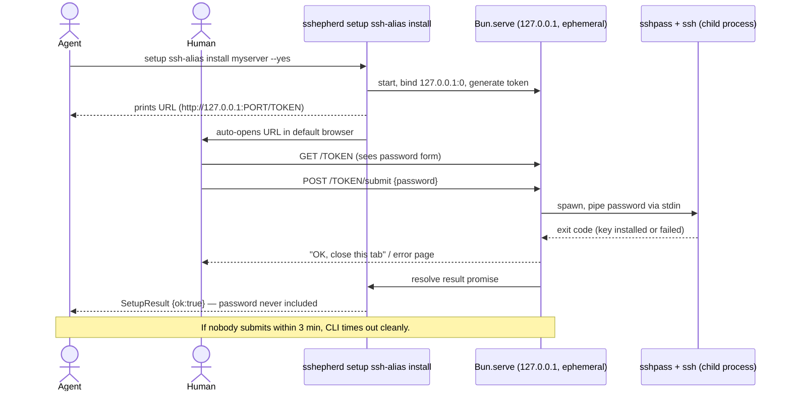

# setup: agent-invocable + install action — Orchestration Plan

## TLDR — North Star

> Flip `setup`'s framing from "human-only, agent-forbidden" to "agent-invocable, except the one moment a password is typed" — no code changes needed for `register`/`keygen`/`remove`/the 3 scaffolders (confirmed: the human-only rule was never enforced in code, only in docs). Add exactly one new action, `setup ssh-alias install <alias>`, that installs the alias's public key onto the remote via a one-shot `Bun.serve()` localhost-only form — the agent triggers it and waits, but the password itself never reaches the agent's context, a log, or disk.

## Open Questions

Scores are ≥ 8 and risk is medium — populated for transparency on the design choices locked during research, none blocking.

**Concerns** — none blocking. `sshpass` must be installed on the machine running `install` (not bundled, not a Bun/Node stdlib capability) — `Bun.which('sshpass')` checked up front, clear typed error if absent, no fragile pty-expect fallback attempted.

**Confusions** — none. The original "human-only" scoping was a genuine miscommunication (user meant "the browser form is local," not "skip remote install") — resolved via 2 rounds of `AskUserQuestion` this session, both confirmed.

**Assumptions:**
- Anti-hijack token (a `crypto.randomUUID()` embedded in the submit path) is worth the ~3 lines even though loopback+ephemeral-port+one-shot is already a reasonable threat-model fit for a personal dev machine — cheap defense-in-depth, not overkill.
- 3-minute timeout for an abandoned form (nobody submits) — a CLI waiting on one human click doesn't need to wait forever; times out to a clean `SetupResult` error, not a hang.
- `install` requires `--yes` like every other mutating `setup` action, for consistency — even though the agent is now the typical caller.

## Executive summary

The first `setup` build (PR #1, still open) made every action human-only per documentation, but never enforced it in code — confirmed by direct research (`confirmGate`/`auditMutating` take no caller-identity parameter, `setup.ts`'s dispatch is a plain string match, `SKILL.md`'s own gotcha 9 already admits "nothing enforces this technically"). This build corrects the documentation to match what the user actually wants — an agent-first tool where only the literal password-entry moment is walled off — and adds the one genuinely new capability needed to make that wall real: `setup ssh-alias install`, a one-shot local browser form for password entry that an agent can safely trigger without ever seeing the secret.

## 5W+1H

- **What:** One new action (`setup ssh-alias install <alias>`) + a full rewrite of `setup`'s human-only framing across `SKILL.md`/`README.md`/`setup.ts`'s own help text. Zero changes to `register`/`keygen`/`remove`/the 3 scaffolders' actual logic.
- **Why:** User value — the agent can now fully drive server onboarding (register, keygen, install key, scaffold configs) in one autonomous flow, with a human touching a browser tab for exactly one thing: typing a password nobody else ever sees. Technical value — closes the loop the first build left open (no remote key-install path existed at all).
- **Who:** The AI agent (primary caller now), the human (only interacts via the one-shot browser form).
- **When:** Done when `install` is implemented + tested, `bun test` green, `SKILL.md`/`README.md` accurately describe the new agent-invocable-except-password-entry model, and a live end-to-end drive (register → keygen → install against a real reachable test box → verify passwordless login works) succeeds.
- **Where:** `/Users/macbook/Documents/PROJECT_MISPAQUL_ATTORIQ/sshepherd`, branch `feat/setup-command-group` (same branch as the first build, PR #1 still open — this is an amendment to that PR, not a new one).
- **How:** `Bun.serve()` on `127.0.0.1:0` (ephemeral, loopback-only), one-shot HTML form gated by a random path token, `setTimeout`-raced-against-a-Promise for abandonment, `Bun.spawn(['sshpass', '-f', '/dev/stdin', 'ssh', ...])` with the password piped via stdin (never env, never disk, never logged), auto-open via platform `open`/`xdg-open`/`start`.

## Diagrams

## File inventory

### Files to create
- `src/setup-ssh-alias-install-server.ts` — the `Bun.serve()` one-shot form (route handling, token gate, timeout race, HTML form).
- `src/__tests__/setup-ssh-alias-install-server.test.ts` — server logic tests (token validation, timeout, form parsing) without spawning a real `ssh`/`sshpass` process (inject a fake spawn function, same test-seam style as `registry.test.ts`'s `scriptedRunner`).

### Files to modify
- `src/setup-ssh-alias.ts` — add `install(alias, options, configPath?)` alongside `register`/`keygen`/`remove`; reuses the alias's already-registered `HostName`/`User`/`Port` (read via the same stanza-locating logic `remove`/`keygen` already use) to know where to connect.
- `src/setup.ts` — wire `install` into `ssh-alias`'s action dispatch (4th action); update the human-only help-text string (line ~50) to the new framing.
- `src/setup-types.ts` — add `SetupErrorCode` values: `SSHPASS_NOT_FOUND`, `INSTALL_TIMED_OUT`, `INSTALL_FAILED`.
- `SKILL.md` — rewrite frontmatter description, the "9 groups + 1 human-only setup group" heading (now "... + 1 setup group, agent-invocable except the install action's password step"), the `# setup` Quick-reference block comment, Gotcha 9 (rewritten, not deleted — becomes about `install`'s specific password boundary, not a blanket ban), the action count (6 → 7).
- `README.md` — rewrite the `setup` paragraph (lines ~112-117) to match.
- `src/__tests__/skill-doc.test.ts` — update the hardcoded heading regex (lines ~87-88) to match the new heading text; extend the action-count assertion to 7.

### Files to NOT touch
- `src/setup-db-target.ts`, `src/setup-config-allowlist.ts`, `src/setup-deploy-recipe.ts` — zero logic change, already agent-invocable-in-practice, only their SKILL.md documentation framing changes (covered above).
- `src/registry.ts`, `src/transport.ts` — unrelated, `install` follows the same "never import these" discipline as the rest of `setup`.
- `src/audit.ts` — reused as-is; `install`'s `argsSummary` passed to `auditMutating` must include `alias` but must NEVER include the password (enforced by simply never putting it in that object — verify in review).

## Phase breakdown

### Phase 1: Implement `setup ssh-alias install`

**Goal:** `sshepherd setup ssh-alias install <alias> --yes` opens a one-shot local browser form, a human-submitted password installs the alias's public key on the real remote, and the agent's result never contains the password.

**Files:**
- Create: `src/setup-ssh-alias-install-server.ts`, `src/__tests__/setup-ssh-alias-install-server.test.ts`
- Modify: `src/setup-ssh-alias.ts` (add `install`), `src/setup.ts` (wire in), `src/setup-types.ts` (new error codes)

**Dependencies:**
- Requires: none (first phase, builds on the already-shipped `register`/`keygen`)
- Provides: the complete ssh-alias lifecycle (register → keygen → install → [use via any of the 9 groups] → remove)

**Separation of concerns:**
- Handles: the one-shot HTTP server, token generation/validation, timeout race, `sshpass`-based install subprocess, mapping outcomes to `SetupResult`.
- Does NOT handle: SKILL.md/README.md rewriting (Phase 2); does not touch `register`/`keygen`/`remove`'s existing logic beyond reading the stanza's `HostName`/`User`/`Port` for its own connection target.

**Success criteria:**
- [ ] `Bun.which('sshpass')` checked up front; missing → clean `SSHPASS_NOT_FOUND` error, zero server started.
- [ ] Server binds `127.0.0.1` only (never `0.0.0.0`), ephemeral port, one random token per invocation; a request with a wrong/missing token gets 404 (not 403 — don't confirm the route exists).
- [ ] Abandoned form (nobody submits) times out at 3 minutes → clean `INSTALL_TIMED_OUT` `SetupResult`, server stopped, no hang.
- [ ] A submitted password is piped to `sshpass -f /dev/stdin ssh ...` via **stdin**, never `env`, never written to disk, never appears in the returned `SetupResult`, never passed to `auditMutating`'s `argsSummary`.
- [ ] Successful install: the target's `authorized_keys` gains the alias's public key; a REAL live drive (against a reachable test box — reuse one of the 3 already-registered real aliases from this session, or a disposable one) proves passwordless `ssh <alias>` now works.
- [ ] Failed ssh auth (wrong password) → clean `INSTALL_FAILED` `SetupResult` with the real ssh exit code, not a crash.
- [ ] Browser auto-opens via `open`/`xdg-open`/`start` (fire-and-forget, failure to launch never fails the command — falls back to printing the URL).
- [ ] `--yes` required like every other mutating `setup` action.

**Context:**
- Mirror `src/transport.ts`'s `defaultRunner`/`src/setup-ssh-alias.ts`'s `keygen()` for the `Bun.spawn` + timeout + exit-code-mapping pattern — same shape, `stdin:'pipe'` instead of `'ignore'`.
- Test seam: inject a fake spawn/serve function (same `scriptedRunner`-style pattern `registry.test.ts` already uses) so the automated suite never actually spawns `sshpass`/opens a real port during `bun test` — reserve the real end-to-end drive for a manual/live verification step, not the automated suite.

**Concerns:**
- `sshpass` availability varies by machine (absent by default on macOS) — the clean `SSHPASS_NOT_FOUND` error IS the mitigation, not a blocker; document the `brew install sshpass` / distro-package fix in the error message itself.

---

### Phase 2: Rewrite `setup`'s framing (docs)

**Goal:** `SKILL.md`, `README.md`, and `setup.ts`'s own help text all describe the corrected model — agent-invocable by default, with `install`'s password boundary as the one specific, narrow wall — and no future agent session reads the old "never invoke setup" framing.

**Files:**
- Modify: `SKILL.md`, `README.md`, `src/setup.ts` (help-text string only), `src/__tests__/skill-doc.test.ts` (heading regex + action count)

**Dependencies:**
- Requires: Phase 1 (needs the real `install` action to document accurately)
- Provides: the completed, accurately-documented feature.

**Separation of concerns:**
- Handles: documentation only.
- Does NOT handle: any further code logic changes.

**Success criteria:**
- [ ] Gotcha 9 rewritten (not deleted) — new wording makes clear: `register`/`keygen`/`remove`/scaffolders/`install` are all safe for the agent to call; the ONLY boundary is that the agent must never attempt to read, log, or relay the password a human types into `install`'s browser form (which it structurally cannot do anyway, but the doc should say so for a future agent's understanding, not just rely on the code).
- [ ] Heading line reflects "7 actions" (was 6), drops "human-only" framing.
- [ ] `skill-doc.test.ts`'s drift-detection test still passes and still has real teeth (re-run the same live-mutation-experiment style check from the first build's Phase 6 audit if time allows, or at minimum confirm the regex genuinely matches the new heading).
- [ ] `bun test` full suite green, `tsc --noEmit`/`biome check` clean.

**Context:**
- See research doc's exact citations for every place "human-only"/"never invoke" appears (SKILL.md lines 3, 68, 97, 171, 212-216; README.md 112-117) — all must move together, not just Gotcha 9.

**Concerns:**
- None — pure docs phase.

## Cross-phase guidelines

- Same `--yes`/`auditMutating`/`confirmGate` convention as every other `setup` action — no new gating mechanism invented for `install`.
- The password variable's lifetime must be traceable end-to-end in review: received from `req.formData()` → written once to a child process's stdin → goes out of scope. Never interpolated into a string that could reach a log, error message, or `SetupResult`.
- `install` still never imports `OpSpec`/`executeOp`/`REGISTRY` from `src/registry.ts` — same discipline as the rest of `setup`.

## Progress log

(Append-only. Executor subagents add one entry after completing each phase.)

## Review findings

(Filled by reviewer subagent at step 4.)

## Final status

(One paragraph at the end. What was built, how it aligns with plan, any notable learnings.)
