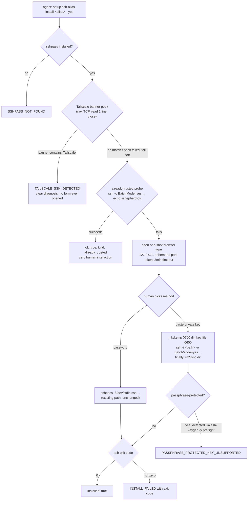
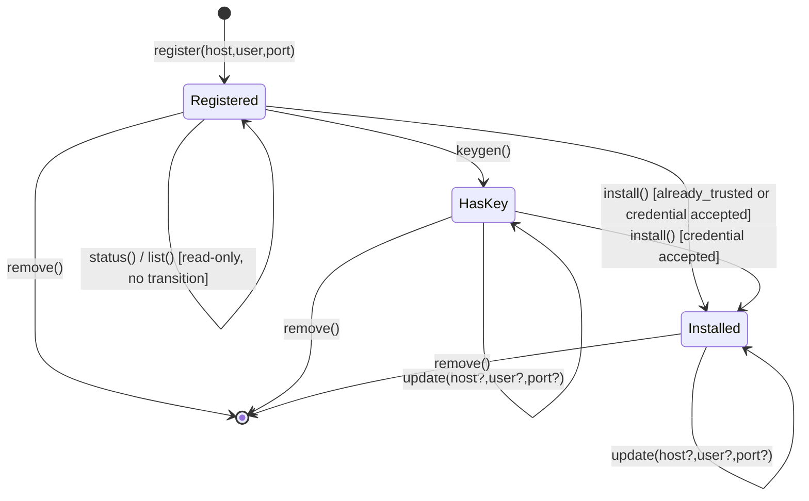

# setup ssh-alias: host lifecycle + smarter install — Orchestration Plan

## TLDR — North Star

> Give `setup ssh-alias` real CRUD (`list`/`status` alongside `register`/`remove`, plus a new
> `update`) and make `install` genuinely smart: it checks whether a target is already reachable
> before ever asking a human for a credential, gives an accurate diagnosis instead of a hang when a
> target is Tailscale-SSH-fronted, and accepts a pasted private key as a second credential method
> alongside password — all inside the same one-shot, zero-external-dependency browser form. One
> governing rule: every phase in this plan touches the same 2-3 core files, so execution is fully
> sequential — no phase runs in parallel with another.

## Open Questions

Scores are ≥ 8 and risk is medium — the one blocking ambiguity (whether `status`/`list` may echo
host/user/port) was already resolved by the user via `AskUserQuestion` this session: **`status` may
echo host/user/port (scoped exception — the caller already supplied it to `register`); `list` stays
name-only; the 9 registry groups are untouched.** Remaining items below are non-blocking, resolved by
the orchestrator's own reasoning during planning (documented for transparency).

**Concerns** — none blocking.

**Confusions** — none. The Termius-parity scope was explicitly corrected by the user mid-session to
host CRUD + credential-method diversity only — no agent-forwarding/proxy/Mosh/host-chaining/themes.

**Assumptions:**
- `update` with no `--host`/`--user`/`--port` flags is an `INVALID_ARGS` CLI-level error ("at least
  one of --host/--user/--port is required"), not a new `SetupErrorCode` — consistent with how
  `register` already validates its required flags.
- `list`'s enumeration is a fresh regex scan over `# sshepherd-managed: <name>` marker lines (self
  contained, doesn't depend on `listHostAliases`'s own alias-extraction logic staying in sync).
- The "setup ⊥ registry/transport" import boundary gets a cheap enforcing test in Phase 5 (grep-based
  assertion) since it's currently a followed convention, not a guarded invariant, and this plan adds
  new probe code that could be tempted to shortcut through `transport.run`.

## Executive summary

`setup ssh-alias` today can register an alias, generate it a keypair, install that key onto a remote
via password, and remove the alias — but has no way to list what's registered, inspect one alias's
state, change an alias's connection details without delete-and-redo, or handle a target that doesn't
accept password auth at all (discovered live this session against a real Tailscale-SSH-fronted box,
where `install` just hung until timeout with no useful diagnosis). This plan closes both gaps: real
CRUD (`list`, `status`, `update`) for managing aliases day-to-day, and a materially smarter `install`
that tries the free options first (already-trusted? Tailscale-fronted?) before ever asking a human to
type anything, and offers a private-key-paste alternative to password when a human interaction is
genuinely needed. Value for the user: this becomes something worth actually using to manage a real
fleet of boxes, not a narrow one-shot bootstrapping script.

## 5W+1H

- **What:** `setup ssh-alias list/status/update` (new) + a 3-outcome-smarter `install` (already-trusted
  short-circuit, Tailscale-fronted diagnosis, password-or-pasted-key credential choice). Zero changes
  to `register`/`keygen`/`remove`'s existing logic.
- **Why:** User value — a fleet operator can see what's managed, fix a typo'd IP without losing the
  generated key, and `install` stops wasting their time asking for a password that can never work.
  Technical value — closes the "install is a dumb one-shot" gap flagged directly by the user this
  session, backed by a real, live-reproduced failure (not hypothetical).
- **Who:** The agent (primary caller for everything except the two secret-entry moments); the human
  (types a password OR pastes a private key into the one-shot form — never both required, exactly one
  per install attempt).
- **When:** Done when all 5 phases are ✅, `bun test`/`tsc --noEmit`/`bun run lint` green, and a live
  drive proves: (a) `list`/`status`/`update` against real registered aliases, (b) already-trusted
  short-circuit against a box that doesn't need install, (c) Tailscale-fronted diagnosis against a real
  Tailscale SSH box, (d) a real pasted-key install against a reachable box.
- **Where:** `/Users/macbook/Documents/PROJECT_MISPAQUL_ATTORIQ/sshepherd`, branch
  `feat/setup-ssh-alias-lifecycle` (new branch off `main` — the two prior `setup` builds are already
  merged; PR #1 is closed).
- **How:** Extend `src/setup-ssh-alias.ts` (new CRUD functions, generalized `upsertStanzaProperty`) and
  `src/setup-ssh-alias-install-server.ts` (pre-check probes, key-paste credential path, new outcome
  kinds) following the exact skeletons/seams already established in those files — no new architecture,
  no new dependency, no new external service call.

## Diagrams

## File inventory

### Files to create
- None — every change extends an existing file's already-established skeleton.

### Files to modify
- `src/setup-ssh-alias.ts`
  - Change: add `list(configPath?)`, `status(alias, configPath?)`, `update(alias, options, configPath?)`; generalize `upsertIdentityFile` into `upsertStanzaProperty(lines, stanza, property, value)` (thin wrapper keeps the old name for existing callers); map 2 new `install()` outcome kinds (`already_trusted`, `tailscale_ssh_detected`) and 3 new outcome/error kinds for the key-paste path.
  - Impact: not GitNexus-indexed, manual read — every existing exported function (`register`/`keygen`/`remove`/`install`) is called only from `src/setup.ts`'s `runSshAliasAction`; no other internal or external callers found via Grep. LOW impact — purely additive to this file, existing call sites unchanged.
  - Reason: this is the file where every `setup ssh-alias` action already lives; new actions follow its established skeleton.
- `src/setup-ssh-alias-install-server.ts`
  - Change: add `peekTailscaleBanner(target)` (raw TCP, read one line, close), `probeAlreadyTrusted(target)` (non-interactive `ssh ... echo sshepherd-ok` mirroring `defaultSpawnInstall`'s shape), `spawnInstallWithKey(privateKeyText, target)` (mkdtemp+0600+`ssh -i`+finally-cleanup), CRLF normalization + `ssh-keygen -y -f <path> -P ''` passphrase-preflight helper, form/POST handler grows a method toggle (password vs. paste), `InstallOutcome` union grows 4 new kinds, `InstallServerDeps` grows 2 new overridable probe fields.
  - Impact: LOW-MEDIUM — the only caller is `install()` in `setup-ssh-alias.ts` (confirmed via Grep); the 19 existing tests use the `Partial<InstallServerDeps>` override seam, so new deps fields are additive and don't break existing test fakes (fakes that don't supply the new fields fall back to defaults).
  - Reason: this is the file that owns the one-shot form and every spawn-based credential path; the pre-checks and the new credential method both belong here, next to the existing password path they extend.
- `src/setup-types.ts`
  - Change: add `SetupErrorCode` values `TAILSCALE_SSH_DETECTED`, `INVALID_PRIVATE_KEY`, `PASSPHRASE_PROTECTED_KEY_UNSUPPORTED`. (`already_trusted` is a SUCCESS outcome, not an error — no new code needed for it.)
  - Impact: LOW — string union, confirmed zero collision with the 14 existing members, confirmed zero call-site churn (docstring already states later phases add to it).
  - Reason: single source of truth for every `setup` error code.
- `src/setup.ts`
  - Change: extend `ssh-alias`'s action list (line 26) from `['register','keygen','remove','install']` to include `list`, `status`, `update`; wire 3 new CLI dispatch branches (lines ~100-142) following the exact `positionals[0]`/flag-parsing pattern already used by `register`; update the top-level/sub-group help text.
  - Impact: LOW — purely additive dispatch entries, existing branches (`register`/`keygen`/`install`/else-is-`remove`) untouched.
  - Reason: single dispatcher for the whole `setup` group.
- `src/__tests__/setup-ssh-alias.test.ts` / `src/__tests__/setup-ssh-alias-install-server.test.ts`
  - Change: extend with new test cases per the success criteria below — never delete or weaken an existing test.
  - Impact: N/A (test files).
  - Reason: every new function needs the same `mkdtempSync`-fixture, injected-fake-spawn/serve test discipline already established.

### Files to NOT touch
- `src/setup-db-target.ts`, `src/setup-config-allowlist.ts`, `src/setup-deploy-recipe.ts` — zero logic change, unrelated scaffolders.
- `src/registry.ts`, `src/transport.ts` — `setup` never imports these; this plan adds a NEW enforcing test for that boundary rather than touching either file.
- `src/audit.ts` — reused as-is; every new mutating action (`update`) follows the exact existing `auditMutating`/`confirmGate` call shape, `argsSummary` for any secret-touching path stays `{}`.
- `SKILL.md`, `README.md`, `src/__tests__/skill-doc.test.ts` — touched ONLY in Phase 5, not before (keeps docs accurate to what actually exists at each intermediate phase, same discipline as the two prior `setup` builds this branch's ancestor PRs used).

## Phase breakdown

### Phase 1: `setup ssh-alias list` + `status`

**Goal:** `list` enumerates every sshepherd-managed alias by name only; `status <alias>` reports one alias's full state (host/user/port/hasKey/managed) as a deliberate, user-approved exception to the name-only rule.

**Files:**
- Modify: `src/setup-ssh-alias.ts`, `src/setup.ts`, `src/__tests__/setup-ssh-alias.test.ts`

**Dependencies:**
- Requires: none (first phase)
- Provides: the enumeration/single-alias-read primitives later phases can build on for verification (e.g. a live drive can `status` an alias to confirm `update` actually changed something)

**Separation of concerns:**
- Handles: read-only enumeration and single-alias inspection, zero mutation, zero credential handling.
- Does NOT handle: any live reachability check (that's what the already-existing `hosts test <alias>` is for — `status` stays local/config-only per research doc's resolved Open Question).

**Success criteria:**
- [ ] `list()` returns `{ aliases: string[] }` — names only, sourced from a fresh scan of `# sshepherd-managed: <name>` marker lines (not by reusing `findManagedStanza`, which only locates one alias).
- [ ] `status(alias)` returns `{ alias, host, user, port, hasKey, managed: true }` when found; reads HostName/User (required) and Port/IdentityFile (optional, defaulting port to 22, `hasKey` computed from IdentityFile presence AND both key files actually existing on disk via `existsSync`).
- [ ] `status` on an unregistered alias returns `ALIAS_NOT_FOUND`; on a marker/shape mismatch returns `PARSE_MISMATCH` — same message pattern as `keygen`/`remove`.
- [ ] Neither action calls `confirmGate`/`auditMutating` (both non-mutating, matching `hosts test`'s `mutating: false` precedent) — no `--yes` required for either.
- [ ] `list`'s output contains zero host/user/port fields under any condition (verified by a test asserting the JSON shape has exactly one key: `aliases`).

**Context:**
- See research doc §Code intelligence for `findManagedStanza`/`stanzaPropertyValue`'s exact shapes to reuse for `status`.
- Pattern to follow: same `readTextOrEmpty` → `splitLines` → work → (no write, no audit) shape as any read path in this codebase.

**Concerns:**
- `status` must work even before `keygen` has run (report `hasKey: false`, not an error) — do not reuse `stanzaInstallTarget` directly, it hard-requires IdentityFile.

---

### Phase 2: `setup ssh-alias update`

**Goal:** Change an existing managed alias's HostName/User/Port in place without losing its generated key or requiring remove-then-register.

**Files:**
- Modify: `src/setup-ssh-alias.ts`, `src/setup.ts`, `src/__tests__/setup-ssh-alias.test.ts`

**Dependencies:**
- Requires: Phase 1 complete (avoids a second executor editing `setup-ssh-alias.ts`/`setup.ts` concurrently — same-file overlap, sequential by necessity)
- Provides: the generalized `upsertStanzaProperty` helper Phase 3/4 do NOT need but future work might

**Separation of concerns:**
- Handles: in-place mutation of HostName/User/Port on an already-registered alias's stanza.
- Does NOT handle: renaming an alias (remains `remove` + `register` under a new name — confirmed sufficient, not duplicated here) or touching the alias's key files at all.

**Success criteria:**
- [ ] `update(alias, {host?, user?, port?, yes})` requires `confirmGate`/`--yes` like every other mutating action; requires at least one of host/user/port — CLI-level `INVALID_ARGS` if none given (`` `setup ssh-alias update: at least one of --host, --user, --port is required` ``).
- [ ] `findManagedStanza` guard reused verbatim (`ALIAS_NOT_FOUND`/`PARSE_MISMATCH`, same message pattern).
- [ ] `upsertIdentityFile` (151-164) generalized into `upsertStanzaProperty(lines, stanza, property, value)`; `upsertIdentityFile` becomes a 1-line wrapper calling it with `'IdentityFile'` — zero behavior change for existing `keygen` callers (regression-tested).
- [ ] Updating only `--port` leaves HostName/User/IdentityFile lines untouched; updating `--host` on an alias that already has a key leaves IdentityFile untouched (key is NOT regenerated or reinstalled by `update` — that stays a separate, explicit `keygen`/`install` step).
- [ ] `auditMutating` called with `argsSummary: { host: '<bool: was it changed>', user: '<bool>', port: '<bool>' }` — booleans only, never the actual new values (matches every other action's discipline of never putting connection details in the audit args hash... wait, `register`'s argsSummary DOES include host/user/port as strings today — confirm consistency with `register`'s existing precedent during implementation and match whichever the codebase already does, don't invent a stricter rule than what's already shipped).

**Context:**
- See research doc §Risks for the `upsertIdentityFile` generalization justification (3+ call sites after this phase: IdentityFile via keygen, HostName/User/Port via update).
- Pattern to follow: identical skeleton to `register`'s flag-parsing in `setup.ts` (`--host`/`--user`/`--port` all optional here, vs. required for `register`).

**Concerns:**
- Verify against `register`'s actual current `argsSummary` shape (`{ host, user, port: String(port), overwrite }` — confirmed non-boolean, includes real values) before writing `update`'s — consistency with the existing precedent matters more than a new, invented stricter rule for this one action.

---

### Phase 3: `install` — already-trusted short-circuit + Tailscale-fronted diagnosis

**Goal:** Before ever opening the browser form, `install` cheaply checks whether the target already works with zero new credentials, and separately detects a Tailscale-SSH-fronted target to give an accurate diagnosis instead of a timeout.

**Files:**
- Modify: `src/setup-ssh-alias-install-server.ts`, `src/setup-ssh-alias.ts`, `src/setup-types.ts`, `src/__tests__/setup-ssh-alias-install-server.test.ts`

**Dependencies:**
- Requires: Phase 1/2 complete (same-file sequencing)
- Provides: the `InstallOutcome` union's expanded shape that Phase 4 extends further

**Separation of concerns:**
- Handles: two new pre-checks that run before `which('sshpass')`/server-open; mapping their outcomes to `SetupResult`.
- Does NOT handle: the key-paste credential method (Phase 4) — this phase only touches the PRE-check layer, the existing password flow is otherwise unchanged.

**Success criteria:**
- [ ] `peekTailscaleBanner(target)`: opens a raw TCP socket to `target.host:target.port`, reads only the first `\r\n`-terminated line, closes the socket, checks for `Tailscale` (case-sensitive per the observed real banner) — never invokes the `ssh`/`sshpass` binaries for this check. Times out and fails soft (treated as "not Tailscale, proceed") within ~3 seconds if the peek itself hangs or errors for unrelated reasons.
- [ ] If Tailscale detected: `install()` returns `{code: 'TAILSCALE_SSH_DETECTED', message: "alias '<alias>' is fronted by Tailscale SSH, which does not use authorized_keys — install cannot place a key here; the target must already be authorized via Tailscale's own ACL/identity, or reached over a non-Tailscale network path"}` — zero server opened, zero password ever requested.
- [ ] `probeAlreadyTrusted(target)`: mirrors `defaultSpawnInstall`'s spawn+timeout shape, runs `ssh -o BatchMode=yes -o ConnectTimeout=<n> -p <port> <user>@<host> -- echo sshepherd-ok` (short timeout, ~5-8s) with NO password/key supplied at all.
- [ ] If already-trusted probe succeeds: `install()` returns `ok: true` immediately (`kind: 'already_trusted'` internally, surfaced in `data` however the existing success shape is extended) — zero server opened, zero human interaction.
- [ ] If neither short-circuit fires: falls through to the EXACT existing `which('sshpass')` → server-open → password-form flow, byte-for-byte unchanged (regression-tested against the 19 existing tests, all must still pass unmodified).
- [ ] Both new probe functions are overridable via `InstallServerDeps` (new fields, e.g. `peekBanner`/`probeReachable`), injected as fakes in tests — `bun test` never opens a real socket or spawns real `ssh` for these checks either.

**Context:**
- See research doc's captured live `ssh -v` transcript for the exact banner string/failure message this must detect and diagnose against.
- Pattern to follow: `defaultSpawnInstall`'s spawn+setTimeout+cleanup shape (95-124) — mirror, don't reinvent.

**Concerns:**
- The Tailscale banner string is an undocumented implementation detail (research doc §Risks) — detection must never crash or block the whole install flow if the peek itself fails for an unrelated reason (firewall, DNS, etc.); any peek failure other than a genuine Tailscale-match falls through to the already-trusted probe, not to a hard error.

---

### Phase 4: `install` — private-key paste credential method

**Goal:** The one-shot form gains a second credential method — paste an existing private key — that installs the same generated public key via `ssh -i` instead of password, with the same "agent never sees the secret" guarantee and an honest accounting of where it structurally cannot match the password path's guarantees.

**Files:**
- Modify: `src/setup-ssh-alias-install-server.ts`, `src/setup-ssh-alias.ts`, `src/setup-types.ts`, `src/__tests__/setup-ssh-alias-install-server.test.ts`

**Dependencies:**
- Requires: Phase 3 complete (extends the same `InstallOutcome` union and form/POST handler this phase touches)
- Provides: the completed, fully-smart `install` action

**Separation of concerns:**
- Handles: the key-paste form field, temp-file materialization, `ssh -i` spawn, passphrase-rejection preflight, cleanup.
- Does NOT handle: file upload (paste only, per research doc's resolved scope decision) or non-interactive passphrase support (rejected outright in v1, per research doc).

**Success criteria:**
- [ ] Form gains a method toggle (password fields vs. a private-key `<textarea>`) — same inline-CSS-only, zero-external-dependency constraint as the existing form.
- [ ] Pasted text is CRLF-normalized (`\r\n` → `\n`) before any further processing.
- [ ] A `ssh-keygen -y -f <path> -P ''` preflight (against the freshly-written temp file) detects passphrase-protection; if detected, `install()` returns `{code: 'PASSPHRASE_PROTECTED_KEY_UNSUPPORTED', message: "the pasted key is passphrase-protected, which sshepherd's install cannot supply non-interactively; use an unencrypted key or the password method instead"}` — temp file removed immediately either way.
- [ ] If the pasted text doesn't parse as a private key at all (preflight/parse failure unrelated to passphrase), returns `{code: 'INVALID_PRIVATE_KEY', message: "the pasted text does not look like a valid private key"}` — never spawns the real install attempt.
- [ ] Valid, unencrypted key: written to `mkdtempSync(realpathSync(os.tmpdir()) + 'sshepherd-key-')`, directory `0700`, key file opened via `O_CREAT|O_EXCL|O_WRONLY` mode `0o600` at creation (never chmod-after-write), `ssh -i <path> -o BatchMode=yes -o ConnectTimeout=<n> ...` spawned and awaited, `finally { rmSync(dir, {recursive:true, force:true}) }` runs for BOTH success and failure outcomes.
- [ ] Test asserts the temp directory does not exist after `spawnInstallWithKey` returns, for both a success-outcome fake and a failure-outcome fake.
- [ ] The pasted key content NEVER appears in: the returned `SetupResult`, any error message string, `auditMutating`'s `argsSummary` (stays `{}`), or any log line — verified by the same "grep the diff for the secret-carrying variable name, trace every reference" discipline the password path got, PLUS an explicit test asserting `JSON.stringify(outcome)` never contains the test fixture's private key material (mirrors the existing password test's `not.toContain('super-secret-password')` pattern).
- [ ] `--yes` still gates the whole `install` action identically regardless of which method the human eventually picks (unchanged from Phase 3).

**Context:**
- See research doc §Risks for the full OpenSSH-source-verified rationale on why disk-touch is unavoidable here (unlike password) and why passphrase support is deliberately out of scope for v1.
- Pattern to follow: `defaultSpawnInstall`'s spawn+timeout+cleanup shape, extended with the temp-file lifecycle.

**Concerns:**
- SIGKILL is an accepted residual risk for the temp key file (no `finally` runs on SIGKILL) — document this in code comments and in Phase 5's docs update rather than attempting to fully close it (out of reach for a v1 subprocess-based design).

---

### Phase 5: Docs + import-boundary test

**Goal:** `SKILL.md`/`README.md` accurately describe the completed 10-action `setup ssh-alias`/`setup` group (register/keygen/install/remove/list/status/update + 3 scaffolders) and install's new smart-then-secret-entry flow; the `setup ⊥ registry/transport` convention becomes an enforced test, not just a followed one.

**Files:**
- Modify: `SKILL.md`, `README.md`, `src/__tests__/skill-doc.test.ts`, new test file or addition asserting the import boundary

**Dependencies:**
- Requires: Phases 1-4 complete (needs the real, final action set and `install` behavior to document accurately)
- Provides: the completed, accurately-documented feature

**Separation of concerns:**
- Handles: documentation and one small guardrail test.
- Does NOT handle: any further logic changes.

**Success criteria:**
- [ ] `SKILL.md`'s action count and Quick-reference block updated to include `list`/`status`/`update` with real example invocations for each.
- [ ] `SKILL.md`'s Gotcha 9 (or a new gotcha, whichever fits better) explains: `install` now tries already-trusted and Tailscale-fronted detection before ever asking for a credential; when it does ask, a human may supply EITHER a password OR paste an existing private key, and the agent never sees either.
- [ ] `README.md`'s `setup` paragraph updated to match.
- [ ] A new or extended test asserts zero `from './registry'` / `from './transport'` imports anywhere in `setup-ssh-alias*.ts` (grep-based, cheap, per research doc's resolved Open Question).
- [ ] `skill-doc.test.ts`'s drift-detection heading/count assertions updated and re-verified to have real teeth (same live-mutation-experiment discipline as the prior two `setup` builds — change a number, confirm the test fails, revert, confirm it passes).
- [ ] `bun test` full suite green, `bunx tsc --noEmit`/`bun run lint` clean.

**Context:**
- See research doc's citation of the exact `SKILL.md` lines (40/51/55/172/183) already stating the zero-knowledge rule — the new `status` exception needs to be stated precisely there too, not just in the Quick-reference block, since a future agent reading only the structural claim at line 51 would otherwise be misled about `status`'s scoped exception.

**Concerns:**
- None — pure docs + one guardrail test phase.

## Cross-phase guidelines

- Every phase's spawn-based new code (probes, key-based install) mirrors `defaultSpawnInstall`'s
  spawn+`setTimeout`+cleanup shape — no new spawn pattern invented.
- Every new secret-touching code path (pasted key) gets the SAME "trace the variable end-to-end,
  confirm it never reaches a returned result/error message/audit argsSummary/log line" review
  discipline the password path already received 3 times this session (per-phase + cross-phase, twice
  independently re-derived) — this is non-negotiable for Phase 4 specifically.
- `setup` never imports `OpSpec`/`executeOp`/`REGISTRY`/`transport.run` — same discipline as the whole
  group, now backed by an actual test (Phase 5) instead of just convention.
- Every new form field/route gets a test that resolves the REAL rendered markup (via `new URL(x,
  pageUrl)` or equivalent), never just a hand-built `Request` object with an already-correct path —
  directly motivated by the relative-URL bug this exact file already shipped once.
- `list`/`status` are non-mutating (no `--yes`, no audit log entry) — matches `hosts test`'s existing
  `mutating: false` precedent in the registry-driven groups; `update` IS mutating (needs `--yes`,
  writes an audit entry) — matches `register`/`keygen`/`remove`/`install`.

## Progress log

(Append-only. Executor subagents add one entry after completing each phase.)

## Review findings

(Filled by reviewer subagent at step 4.)

## Final status

(One paragraph at the end. What was built, how it aligns with plan, any notable learnings.)
